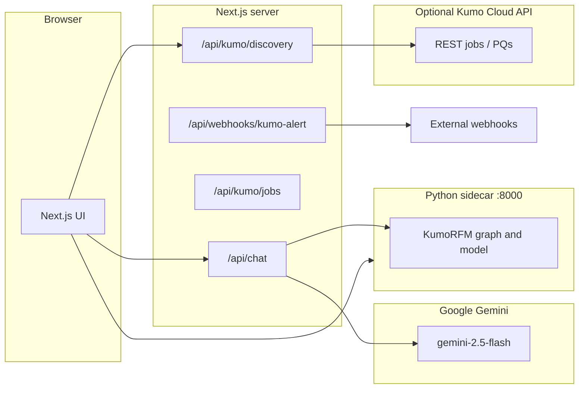

# Kumo Catalyst (Kumo-POS) — Project Overview

This document describes **what the project is**, **how it is built**, and **what users can do** with it. It reflects the codebase as of the current repository layout.

---

## 1. Executive summary

**Kumo Catalyst** is a **retail intelligence copilot** aimed at merchandising-style workflows. It combines:

- A **Next.js** single-page experience with a chat-first layout and a right-hand **Intelligence Board** plus **Explain** drill-down.
- **Google Gemini** (via `@google/genai`) for **natural-language intent routing** and **business-language narration** of structured prediction results.
- A **Python FastAPI sidecar** that runs the **KumoRFM** (`kumoai`) SDK over a **public H&M-style transactional dataset** loaded from S3, exposing REST endpoints for demand, churn, recommendations, explainability, and more.
- Optional **Kumo Cloud REST API** integration (server-only keys) for **job discovery**, **predictive query** metadata, and **console deep links** when configured.

The product narrative positions the user as a **Head of Merchandising** (or similar) asking questions about **demand**, **churn**, **inventory targeting**, and **customer-level explanations**.

---

## 2. High-level architecture

- **Browser** talks to **Next.js** (UI + Route Handlers). It also calls the **sidecar** directly for board health and intelligence data (with CORS controlled on the sidecar).
- **`/api/chat`** orchestrates **Gemini** and **HTTP calls to the sidecar** (never exposing `GEMINI_API_KEY` or `KUMO_API_KEY` to the client).
- **`/api/kumo/*`** routes use **server env** (`KUMO_REST_API_KEY`, etc.) to enrich discovery and jobs; responses can include **demo data** when REST is not configured.

---

## 3. Technology stack

### 3.1 Frontend (Node / Next.js)

| Layer | Technology |
|--------|------------|
| Framework | **Next.js 15** (App Router), **React 19** |
| Language | **TypeScript** |
| Styling | **Tailwind CSS 4**, **PostCSS**, **tw-animate-css** |
| State | **Zustand** (`persist` for selected client state) |
| Charts | **Recharts** |
| Motion | **motion** (Framer Motion successor) |
| Icons | **lucide-react** |
| UI primitives | **Base UI** (`@base-ui/react`) — e.g. tabs used in explain UI |
| Graph (explain) | **react-force-graph-2d** (where used in explain flows) |
| AI (client-adjacent) | Packages such as `ai`, `@ai-sdk/google` are present; **primary chat path uses server route + `@google/genai`** |

### 3.2 Backend — Next.js API routes (Route Handlers)

| Route | Role |
|-------|------|
| `POST /api/chat` | Two-step pipeline: `step: "intent"` → classify and extract entities; `step: "narrate"` → call sidecar + Gemini JSON narration. Injects optional **REST context snippet** into system prompts. |
| `GET /api/kumo/discovery` | Aggregates **jobs** + **predictive queries** (REST or demo), exposes `configured`, `kumoAppBaseUrl`, etc. |
| `GET /api/kumo/jobs` | Lists normalized jobs; enriches with **console URLs** when `KUMO_APP_BASE_URL` is set. |
| `GET /api/kumo/jobs/[jobId]` | Single job by id, same normalization/enrichment. |
| `POST /api/webhooks/kumo-alert` | Relays JSON payloads to an optional `forwardTo` HTTPS URL (alerts / tests). |

### 3.3 Backend — Python sidecar

| Component | Technology |
|-----------|------------|
| Server | **FastAPI** + **Uvicorn** |
| Data | **pandas**, **pyarrow**, **fsspec/s3fs** for S3 reads |
| ML / graph | **kumoai** (KumoRFM experimental RFM APIs) |
| Default data | **H&M public RFM dataset** under `s3://kumo-sdk-public/rfm-datasets/online-shopping` (anonymous read) |

Sidecar listens on **`0.0.0.0:8000`** by default (`python main.py`).

### 3.4 DevOps & quality

- **ESLint** (`eslint-config-next`)
- **Vitest** + **jsdom** + **Testing Library** for unit/component tests
- **GitHub Actions** CI: `npm ci` → lint → test → `next build`

### 3.5 Build output

- `next.config.ts` sets **`output: 'standalone'`** for container-friendly production bundles.

---

## 4. Domain model (retail dataset)

The demo stack is aligned to a **fashion retail** graph:

- **Users**, **items**, **orders** tables with realistic join keys.
- Sidecar builds a **KumoRFM graph** (nodes/edges), warms **prediction caches**, and exposes **link health** (e.g. FK match rates) for trust diagnostics.
- Product imagery for UI cards uses **curated Unsplash URLs** mapped by **category/color** heuristics (not random placeholders).

---

## 5. Core product features

### 5.1 Chat copilot

- **Phased “thinking” indicator** (three steps: routing → fetching context → synthesizing).
- **Intent step** (`POST /api/chat` with `step: "intent"`): Gemini classifies into capabilities such as **demand forecast**, **churn list**, **reverse recommendation**, **cold affinity**, **explain**, **graph schema**, or **text** (small talk / out-of-scope).
- **Normalized intent** (`lib/chat/intent-payload.ts`): clamps capabilities, optional **confidence** and **clarifying_question**, merges trace warnings.
- **Narrate step**: server calls the **sidecar** according to capability and entity id, then **Gemini** returns JSON with `narration` and `followUps`.
- **Fast path** for low-signal **text** intents: canned helpful replies without sidecar.
- **Trace UI**: expandable run trace (steps, latency, warnings) on assistant messages.
- **Feedback**: thumbs up/down on assistant messages (stored in client state / analytics hooks in store).
- **Discovery chips** (`lib/chat/discovery-chips.ts`): contextual quick actions under results; can prepend **Kumo Cloud discovery** chips (e.g. open console, ask about jobs) when discovery payload exists.

### 5.2 Intelligence Board (right rail)

- Loads from **`GET /data/intelligence-board`** (sidecar) via the store.
- Shows **category demand**, **item demand**, **churn-at-risk** summaries, **timeframe**, and **trust / health** signals (graph mode, cache coverage, link health, etc.).
- **Kumo Cloud discovery strip** when REST is configured: surfaces tenant jobs / predictive-query awareness.
- Interactions: drill to **Explain**, send prompts to chat, **handoff** flows (e.g. CRM-oriented labels).

### 5.3 Explainability

- **Unified Explain view** loads **per-customer** explain payloads from the sidecar (`/predict/explain` and related data).
- **`ExplainPanel`** presents signals, subgraph / peer context, and charts depending on available data.
- Chat can route to **explain** capability with a **user id**; the UI can load explain data and synchronize the right panel.

### 5.4 Search & saved queries (UX)

- **Search modal**: fuzzy search over history and quick actions (`lib/utils/search.ts`).
- **Saved queries panel**: local persistence of saved searches / history patterns (`lib/utils/saved-queries.ts`, `lib/types/saved-queries.ts`).

### 5.5 Export & handoffs

- **CSV export** helpers for demand, churn, reverse rec, cold affinity (`lib/utils/csv-export.ts`).
- **Handoff records** for downstream systems (e.g. campaign labels) via `lib/business/stylist-handoff.ts`.

### 5.6 Webhooks

- **Alert relay** endpoint forwards structured payloads to customer webhooks for future automation or tests.

---

## 6. Chat capabilities ↔ sidecar mapping (conceptual)

| Intent capability | Typical sidecar usage |
|-------------------|------------------------|
| `demand_forecast` | Demand prediction endpoints; board refresh |
| `churn_list` | Churn / at-risk customer lists |
| `reverse_rec` | Reverse recommendation (who should buy an item) |
| `cold_affinity` | Cold-start / affinity style predictions |
| `explain` | Explain prediction for a user (and panel sync) |
| `graph_schema` | Schema / graph description (as implemented in route + sidecar) |
| `text` | No sidecar; conversational fallback |

Exact HTTP paths and payloads are defined in **`app/api/chat/route.ts`** and **`kumo-sidecar/main.py`**.

---

## 7. State management (`lib/store.ts`)

Zustand holds:

- **messages** (chat transcript with optional `trace`, `data`, `pql`, `type`, etc.)
- **board** (`IntelligenceBoard | null`)
- **explainData** / **activeExplainEntityId**
- **rightPanel** (`"board" | "explain"`)
- **sidecarHealth**, **sidecarConnected**, **sidecarMode**
- **analyticsRuns**, **feedbackLog**, **handoffLog** (derived/merged on message updates)
- **boardFocus**, **explainExcludeLastDays**

The store **fetches the sidecar** from configurable base URLs (env + localhost fallbacks).

---

## 8. Security & configuration

- **Secrets stay server-side**: `GEMINI_API_KEY`, `KUMO_API_KEY` (sidecar), `KUMO_REST_API_KEY` must **not** use `NEXT_PUBLIC_*` for secrets.
- **Sidecar CORS**: defaults to local Next origins; override with `SIDECAR_CORS_ORIGINS` for deployed apps.
- **REST keys** are only used in **Next Route Handlers**, not shipped to the browser.

See **`.env.example`** and **`README.md`** for the full variable list.

---

## 9. Repository layout (top level)

| Path | Purpose |
|------|---------|
| `app/` | App Router: `page.tsx` (main Stylist UI), `layout.tsx`, `api/*` routes |
| `components/` | Chat, board, explain, modals, `ErrorBoundary`, UI tabs |
| `lib/` | `store`, `types`, `constants` (prompts, stylist system prompt), `chat` (intent, discovery chips), `kumo-rest/*`, `business/*`, `utils/*` |
| `kumo-sidecar/` | Python FastAPI service |
| `hooks/` | Reserved for shared hooks (see `hooks/README.md`) |
| `scripts/` | Placeholder / notes (`scripts/README.md`) |
| `.github/workflows/` | CI workflow |

---

## 10. Testing

- **Vitest** runs in CI with tests under `lib/**` and `components/**` (e.g. formatters, widgets, intent payload).
- Commands: `npm test`, `npm run test:watch`.

---

## 11. Related documentation

| File | Content |
|------|---------|
| `README.md` | Quick start, env vars, layout |
| `kumo-sidecar/README.md` | Sidecar setup, CORS, API key |
| `docs/kumo_feature_roadmap.md` | Product/engineering roadmap themes |
| `scripts/README.md` | Note on removed offline data pipelines |

---

## 12. Summary

**Kumo Catalyst** is a **full-stack retail copilot**: **Gemini** for language understanding and narration, **KumoRFM** for graph-based predictions on a **public H&M-style dataset**, and **optional Kumo Cloud REST** for operational discovery—all wrapped in a **polished Next.js** experience with **board**, **explain**, **trace**, **export**, and **discovery** affordances suitable for demos and production extensions.
